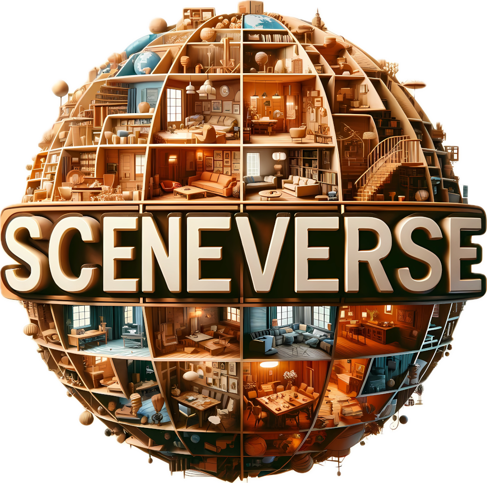

<h2 align="center">
  <span></span>
  <b>SceneVerse: Scaling 3D Vision-Language Learning for Grounded Scene Understanding</b>
</h2>

<div align="center" margin-bottom="6em">
<a target="_blank" href="https://buzz-beater.github.io/">Baoxiong Jia<sup>✶</sup></a>,
<a target="_blank" href="https://yixchen.github.io/">Yixin Chen<sup>✶</sup></a>,
<a target="_blank" href="https://scholar.google.com/citations?user=fKRgnIMAAAAJ/">Huangyue Yu</a>,
<a target="_blank" href="https://github.com/jetpackfirstme">Yan Wang</a>,
<a target="_blank" href="https://nxsedson.github.io/">Xuesong Niu</a>,
<a target="_blank" href="https://tengyu.ai/">Tengyu Liu</a>,
<a target="_blank" href="https://liqing-ustc.github.io/">Qing Li</a>,
<a target="_blank" href="https://siyuanhuang.com/">Siyuan Huang</a>

</div>
&nbsp;

<div align="center">
    <a href="https://arxiv.org/abs/2401.09340" target="_blank">
    </a>
    <a href="https://scene-verse.github.io" target="_blank">
    </a>
    <a href="https://youtu.be/UnujS0EVxKU" target="_blank">
    </a>
    <a href="https://scene-verse.github.io" target="_blank">
    </a>
    <a href="https://scene-verse.github.io" target="_blank">
    </a>
</div>
&nbsp;

<div align="left">

</div>

We propose SceneVerse, the first million-scale 3D vision-language dataset with 68K 3D indoor scenes and 2.5M vision-language pairs.  We demonstrate the scaling effect by (i) achieving state-of-the-art on all existing 3D visual grounding benchmarks and (ii) showcasing zero-shot transfer capabilities with our GPS (Grounded Pre-training for Scenes) model.

## News
- [<span style="color:red">New!</span> 2024-07] Training & Inference code as well as preprocessing code is released and checkpoints & logs are on the way!
- [<span style="color:red">New!</span> 2024-07] Preprocessing codes for scenes used in SceneVerse are released.
- [2024-07] SceneVerse is accepted by ECCV 2024! Training and inference codes/checkpoints will come shortly, stay tuned!
- [2024-03] We release the data used in SceneVerse. Fill out the [form](https://forms.gle/AXMk7MH6bFXpCqd99) for the download link!
- [2024-01] We release SceneVerse on ArXiv. Checkout our [paper](https://arxiv.org/abs/2401.09340) and [website](https://scene-verse.github.io/).

## Getting Started
For data browsing, we experimented with NVIDIA CUDA 11.8 on Ubuntu 22.04 and require the following steps:
```shell
$ conda create -n sceneverse python=3.9
$ pip install torch==2.2.0 torchvision==0.17.0 --index-url https://download.pytorch.org/whl/cu118
$ pip install numpy open3d
```
For training and inference, we provide instructions for using our code base [here](TRAIN.md). It also contains codes for
creating the virtual environment, so if you have already created one for visualization, you can directly install all
requirements via ```requirements.txt```.

## Data

* Note: As some of our users requested the mapping between HM3D object id in SceneVerse to HM3D-semantics, we have added an additional file ```sceneverse2hmsemantic.py``` to obtain this mapping. When running with the target HM3D-semantics scenes, it will generate a dictionary of ```{<sceneverse_objid>:[hm3d_objid, hm3d_label]}``` for each scene.

### Data Processing

We release a data preprocessing exemplar for 3RScan, with more details [here](preprocess/README.md).


### Data Download
We currently host our data on G-drive and request all applicants to fill out the form from [here](https://docs.google.com/forms/d/1x8cCAkn86d6MyyY5PMvvS_qRrH7dV8_RKHeBX9sE3KU).

You should see one or multiple zip file segments for each dataset we provided. For datasets with multiple segments (e.g., ARKitScenes), you can unzip the files with:

```shell
# Directories with multiple zip segments
$ ls ARKitScenes/
  -> ARKitScenes.zip  ARKitScenes.z01

# Unzip from all zip segments
$ cd ARKitScenes/
$ zip -F ARKitScenes.zip --out combined.zip
$ unzip combined.zip
```

After unzipping, the files are organized as:
```shell
ARKitScenes/
|-- scan_data                   # Point cloud data
  |-- instance_id_to_label      # Reorganized instance id to label mapping
  |-- pcd_with_global_alignment # Aligned scene point clouds
|-- annotations                 # Language annotations
  |-- splits
    |-- train_split.txt         # For all datasets, we provide training split
    |-- val_split.txt           # For datasets with evaluation sets
  |-- <language_type>.json      # For datasets except for ScanNet, language for ScanNet is located at annotations/refer
```

### Data Visualization

We also provide a short script for visualizing scene and language data, you can use it with:
```shell
# Visualize scene and instance data
$ python visualize_data.py --root <PATH_TO_DOWNLOAD> --dataset <DATASET>
# Visualize language data
$ python visualize_data.py --root <PATH_TO_DOWNLOAD> --dataset <DATASET> --vis_refer
```

As our data contains scenes from existing datasets, please read carefully about the term of use for each dataset we provided in the form.

### Provided Language Types

We list the available data in the current version of SceneVerse in the table below:

|   Dataset    | Object Caption | Scene Caption | Ref-Annotation   | Ref-Pairwise<br>```rel2``` | Ref-MultiObject<br>```relm``` | Ref-Star<br>```star``` | Ref-Chain (Optional)<br>```chain``` |
|:------------:|:--------------:|:-------------:|------------------|-------------------------|-------------------------------|-----------------------|------------------------------------|
|   ScanNet    |       ✅        |       ✅       | ScanRefer<br>Nr3D | ✅              | ✅                             | ✅           | ✅       |
|  MultiScan   |       ✅        |       ✅       | ✅ | ✅              | ✅                             | ✅           | ✅       |
| ARKitScenes  |       ✅        |       ✅       | ✅ | ✅              | ✅                             | ✅           | ✅       |
|     HM3D     |  ```template```   |       ✅       | ✅ | ✅              | ✅                             | ✅           | ✅       |
|    3RScan    |       ✅        |       ✅       | ❌ | ✅              | ✅                             | ✅           | ✅       |
| Structured3D | ```template``` |       ✅       | ❌ | ✅              | ✅                             | ✅           |    ❌     |
|   ProcTHOR   | ```template``` |    ❌     | ❌ | ```template```              | ```template```                   | ```template```            |    ❌     |

For the generated object referrals, we provide both the direct template-based generations ```template``` and the LLM-refined versions ```gpt```.
Please refer to our supplementary for the description of selected ```pair-wise``` / ```multi-object``` / ```star``` types. We also
provide the ```chain``` type which contains language using obejct A to refer B and then B to refer the target object C. As we found 
the ```chain``` type could sometimes lead to unnatural descriptions, we did not discuss it in the main paper. Feel free to inspect
and use it in your projects.

For the remaining data, we hope to further refine and update our data in the following weeks, stay tuned!


## BibTex
```bibtex
@article{jia2024sceneverse,
  title={SceneVerse: Scaling 3D Vision-Language Learning for Grounded Scene Understanding},
  author={Jia, Baoxiong and Chen, Yixin and Yu, Huangyue and Wang, Yan and Niu, Xuesong and Liu, Tengyu and Li, Qing and Huang, Siyuan},
  journal={arXiv preprint arXiv:2401.09340},
  year={2024}
}
```
